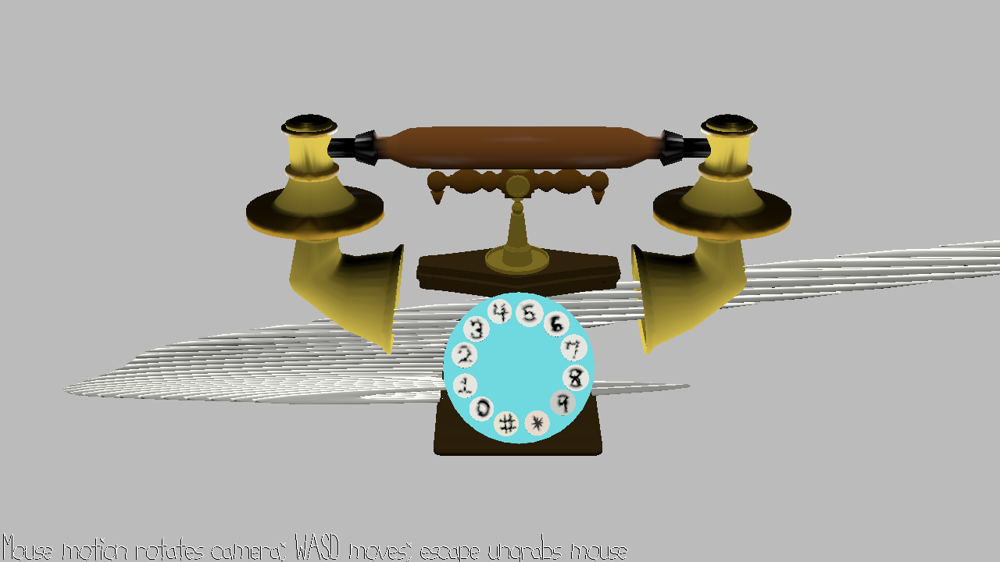

Phone Numbers: A Telephone Spin-off 

Author: Jeffrey Wang

Takes the classic telephone game and create song based memorization game where
the phone numbers you have to remember increase per level, and change over time

Screen Shot:

How To Play:

Use keys: 1,2,3,4,5,6,7,8,9,0,Q(for pound #), and W( for astrick *) to play a sound

There will be a random melody of songs playing, where you then have to repeat the song 
in the same order in under a tight timelimit. The number of songs you have to 
remember increase per level and the notes change the more you play like, the 
game telephone!

This game was built with [NEST](NEST.md).
